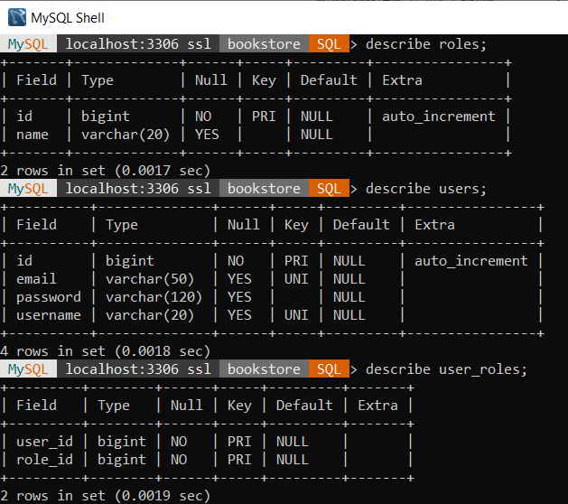
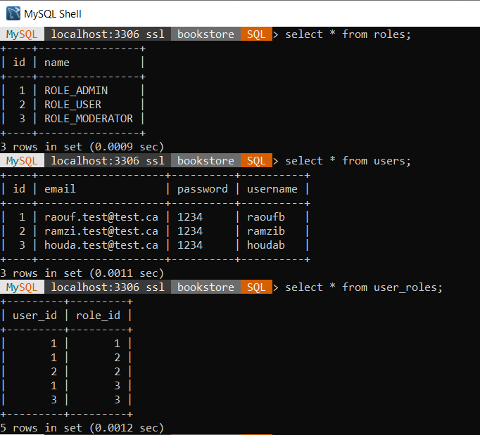
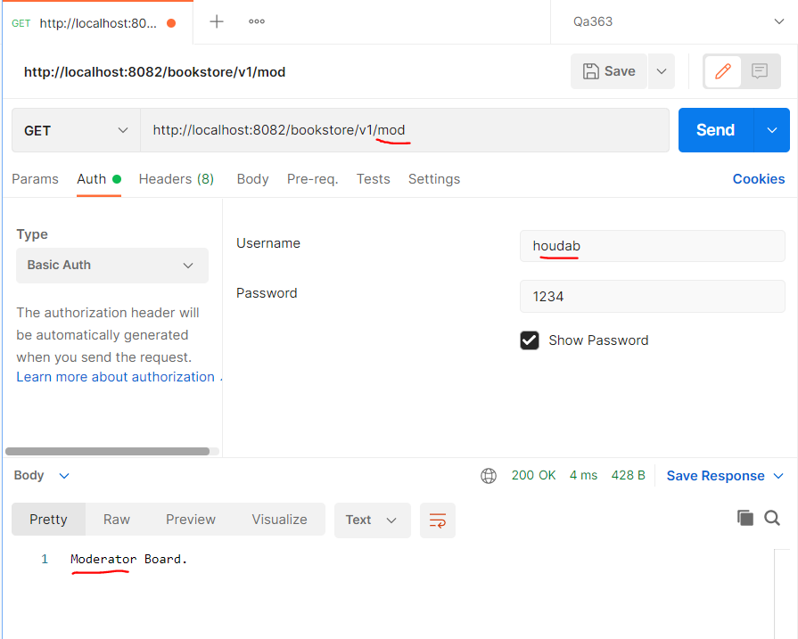

 # 1. Getting Started
 In this project, we’re gonna build a Spring Boot Application that supports Spring security using a MySQL database. You’ll know:
 
 Spring Boot Application Architecture with Spring Security
 How to configure Spring Security
 How to define Data Models and association for Authentication and Authorization
 Way to use Spring Data JPA to interact with H2/MySQL Database
 
 # Technologies used :
     Spring 2.5.3
     Spring Security 5.5.1
     Tomcat embed 9.0.50
     Maven 3
     Java 11
     MySQL 8.0.26
 ### Reference Documentation
 For further reference, please consider the following sections:
 
 * [Official Apache Maven documentation](https://maven.apache.org/guides/index.html)
 * [Spring Boot Maven Plugin Reference Guide](https://docs.spring.io/spring-boot/docs/2.5.3/maven-plugin/reference/html/)
 * [Create an OCI image](https://docs.spring.io/spring-boot/docs/2.5.3/maven-plugin/reference/html/#build-image)
 * [Spring Boot Actuator](https://docs.spring.io/spring-boot/docs/2.5.3/reference/htmlsingle/#production-ready)
 * [Spring Data JPA](https://docs.spring.io/spring-boot/docs/2.5.3/reference/htmlsingle/#boot-features-jpa-and-spring-data)
 * [Spring Web](https://docs.spring.io/spring-boot/docs/2.5.3/reference/htmlsingle/#boot-features-developing-web-applications)
 * [Spring Security](https://docs.spring.io/spring-boot/docs/2.5.3/reference/htmlsingle/#boot-features-security)
 * [Validation](https://docs.spring.io/spring-boot/docs/2.5.3/reference/htmlsingle/#boot-features-validation)
 
 ### Guides
 The following guides illustrate how to use some features concretely:
 
 * [Building a RESTful Web Service with Spring Boot Actuator](https://spring.io/guides/gs/actuator-service/)
 * [Accessing Data with JPA](https://spring.io/guides/gs/accessing-data-jpa/)
 * [Building a RESTful Web Service](https://spring.io/guides/gs/rest-service/)
 * [Serving Web Content with Spring MVC](https://spring.io/guides/gs/serving-web-content/)
 * [Building REST services with Spring](https://spring.io/guides/tutorials/bookmarks/)
 * [Securing a Web Application](https://spring.io/guides/gs/securing-web/)
 * [Accessing data with MySQL](https://spring.io/guides/gs/accessing-data-mysql/)
 
 # 2. Run the app in docker
 ```
 cd spring-security-example
 
 mvn clean install
 
 docker-compose up --build
 ```
 
 # 3. Connect to database using MySQL Shell :
 In the command line, run :
 ```
 docker exec mysql-db mysqld --skip-grant-tables
 ```
 
 In the MySQL Shell, run the command :
 ```
 \sql
 
 \connect --mysql user@localhost:3306/bookstore
 
 password : password
 
 describe users;
 describe roles;
 describe user_roles;
 
 select * from roles;
 select * from users;
 select * from user_roles;
 ```
 ## Schema


 ## Data


 # 4. Test the application :
 
 Browse to the app at http://localhost:8082/swagger-ui.html#/ or use postman
 
 ## Requests authorizations: 
 
 
 * The endpopints /bookstore/v1/ and /swagger-ui.html are public (accessible by everyone).
 * Only users having the role ADMIN can access to the endpoint /bookstore/v1/admin
 * Only users having the role MODERATOR can access to the endpoint /bookstore/v1/mod
 * All users having any of the roles USER, ADMIN or MODERATOR can access to the endpoint /bookstore/v1/user
 
 ## Users authorizations:
 
 
 * The user raoufb has roles ADMIN, USER and MODERATOR, so he has access to all endpoints
 
 
 
 
 
 
 
 
 
 * The user ramzib has only the role USER, so he has access only to /bookstore/v1/user
 
 
 
 
 
 
 
 * The user houdab has only the role MODERATOR, so he has access to /bookstore/v1/mod and /bookstore/v1/user
 
 
 
 
 
 

